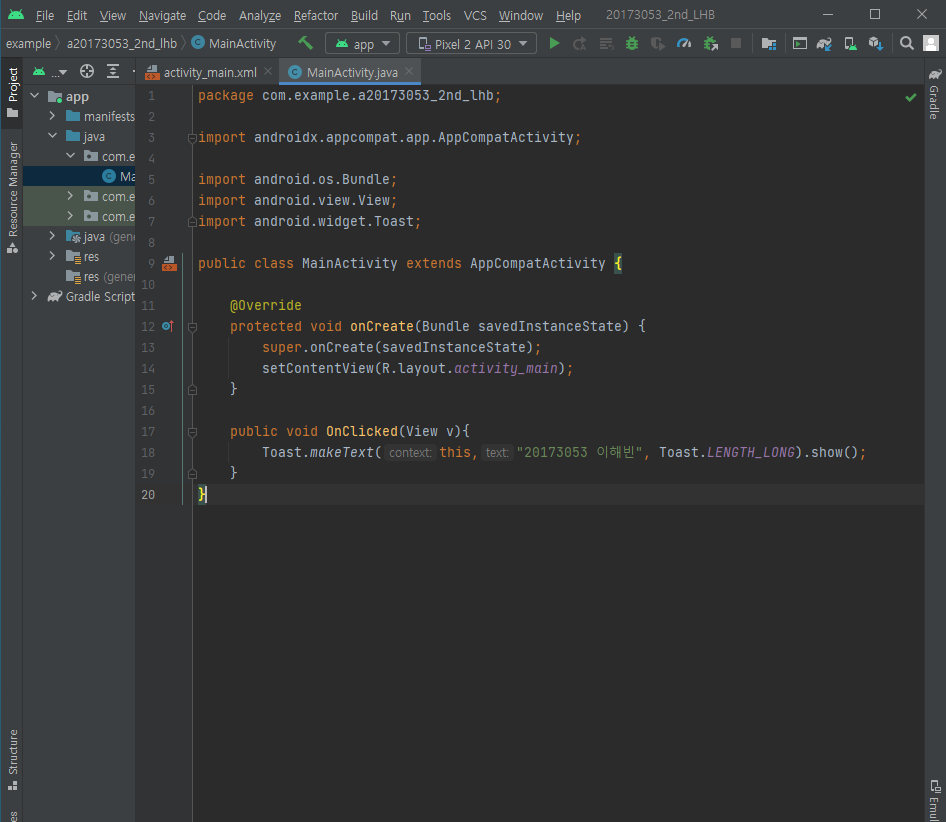
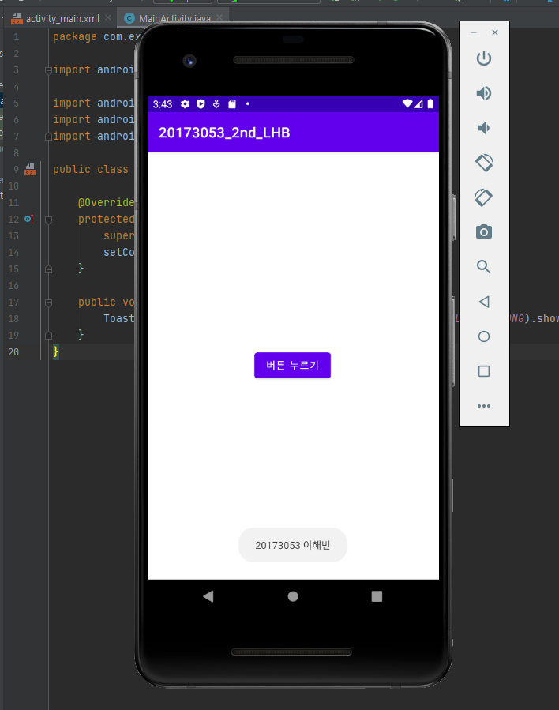
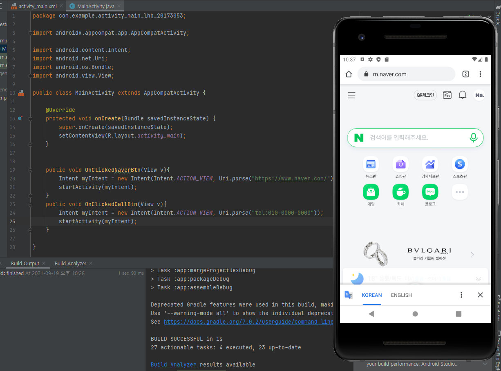
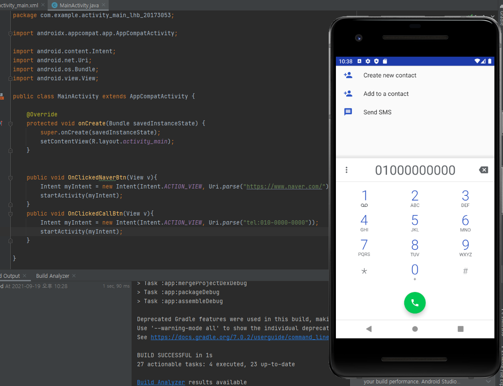
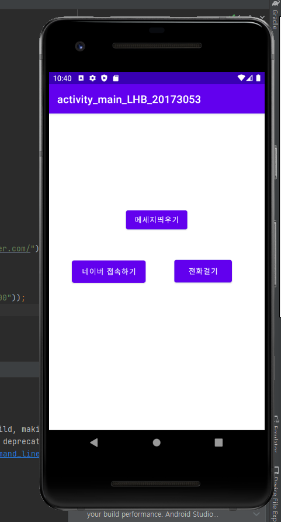
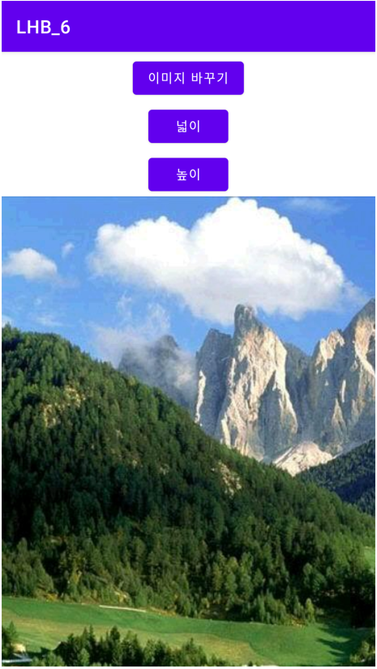
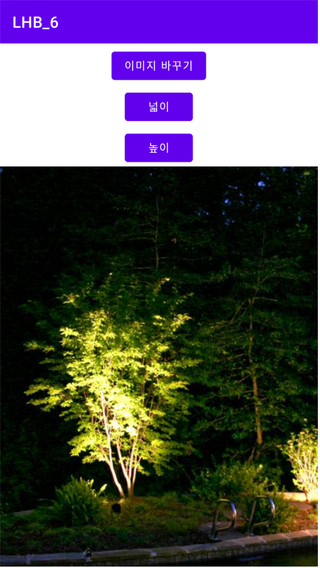
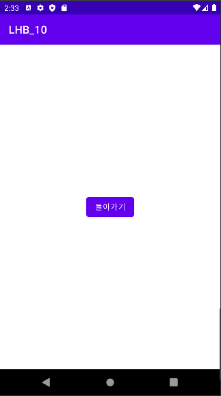
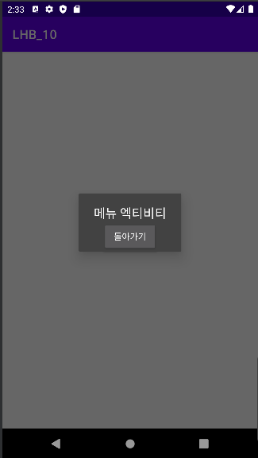
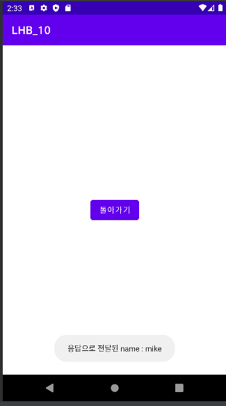

# 캡스톤 디자인 주간 A반

## 1주차

## 2주차
- Github 사용법
- 안드로이드 스튜디오 시작하기
  
  </img>
  
  </img>
  
## 3주차
  </img>
  
  </img>

  </img>

## 4주차
- 앱 아이디어: 패션 관련
   
-사용자의 체형을 분석-> 나이/키/몸무게/카메라 측정 등 여러요소

-사용자의 취향 파악 후 알고리즘-> 본인이 선호하는 스타일, 싫어하는 스타일 등

-분석 데이터를 활용 후 접목-> 체형과 전반적인 느낌을 기준으로 
  추천하는 스타일과 좋아하는 스타일의 접목도를 수치화 시켜서 사용자가 수치를 조정하여
  각각 본인이 원하는 스타일만의 추천을 받거나 체형과 분위기에 따른 스타일만의 추천 또는
  그에 중간인 타협된 스타일의 추천을 받을 수 있다.(알고리즘)
  
 -검색 사용 가능-> 태그 등을 활용하여 세분화 시킴
 
 -찜/장바구니/보았던 것/구매/택배조회(상태) 등 기본적인 메커니즘 존재
 
 -해당 브랜드 및 쇼핑몰 관련 중요, 핵심 정보 서치 목록에 존재(전화번호 같은것 등)
 
 -사용자의 프로필 공개화 설정 자유도(다른 사용자에게 보여지는 것)
 
 -여러 쇼핑몰 또는 자체 쇼핑몰 존재
 
 -사용자는 검색기능과 알고리즘 기능을 이용하여 스타일에 따른 옷이나 브랜드를 찾아볼 수 있다.
 
 -가상 피팅 기능
 
 -리뷰/사진 리뷰 구분 등 리뷰 확인의 수월함(비방용 목적 또는 그러한 문제의 글은 삭제 조치)
 
 -소비자와 판매자간의 원활한 이용-> 수량 표시를 바로 할 수 없는 경우나 배송 지연 등 여러 문제에 대한 경고를 미리 적을 수 있는 경우 
   시스템화(ex:재고가 얼마 안남은 상태->동시 접속자가 많아 취소되는 경우를 막기위해 
   일정수량에 도달했을 경우 옆에 주의 문구가 뜨는 시스템)와 빠른공지
   
 -인스타그램과 같이 커뮤니티 기능->오로지 패션관련(ootd 같은 것)/싸이버 불링 또는 그러한 불상사를 막기위해 
   댓글과 반응은 정해진 문구 내에서 가능, 다른 말을 전달하고 싶을때는 메신저로 개개인의 판단에 따라 가능
   (서로 팔로우할시에만 직접 메신저를 가능하게 해두던가, 수락할 경우 등... 그런데 만약 이러한 경우가 불편할 시에는 
   사용자가 본인의 설정에 들어가서 댓글과 반응의 자유도 조정가능(자유롭게 댓글 반응 가능)
   
 -여러 이벤트도 진행-> 자체적 이벤트 진행, 특정 브랜드 내지는 쇼핑몰과 협업하여 진행하는 이벤트 진행, 커뮤니티 기능을
   활용하여 이벤트 진행, 생일 이벤트 등

## 5주차
</img>

</img>

## 6주차
</img>

</img>

## 9주차

## 10주차
</img>

</img>

</img>
